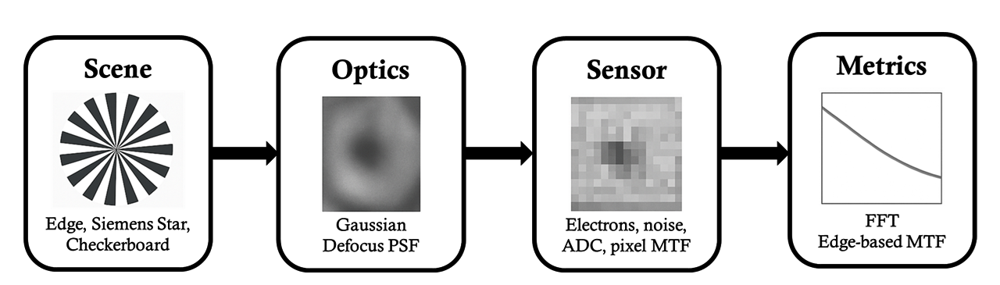

<p align="center" style="margin-top:20px;">
  
</p>

<h1 align="center"> Imaging Pipeline Simulator</h1>
<p align="center"><em>Scene → Optics → Sensor → Metrics</em></p>

<hr style="border:0.5px solid #ccc; margin:30px 0;">

## 📑 Quick Navigation
- [1. Summary](#1-summary)
- [2. Pipeline Overview & System Architecture](#2-pipeline-overview--system-architecture)
- [3. Module Architecture](#3-module-architecture)
- [4. Scene Modeling Theory](#4-scene-modeling-theory)
- [5. Optics Modeling Theory](#5-optics-modeling-theory)
- [6. Sensor Modeling Theory](#6-sensor-modeling-theory)
- [7. Metrics and Analysis Theory](#7-metrics-and-analysis-theory)
- [8. CLI Usage, Reference Experiments, and Workflows](#8-cli-usage-reference-experiments-and-workflows)
- [9. Extensibility](#9-extensibility-and-advanced-pipeline-development)
- [Intended Uses](#-intended-uses)
- [License](#-license)
- [Author](#-author)

<hr style="border:0.5px solid #ccc; margin:30px 0;">

<div align="center">

# 📘 **1. Summary**

</div>

The *Imaging Pipeline Simulator* models the complete signal-formation sequence of a digital imaging system. Its design integrates analytically defined scenes, physically interpretable optical blur models, and pixel-level sensor behavior into a unified and deterministic pipeline suitable for quantitative analysis.

The simulator represents the imaging chain: **Scene → Optics → Sensor → Metrics**

and provides a controlled environment for studying:

- Formation and transformation of irradiance distributions  
- Point-spread–based optical degradation  
- Sensor-level electron generation and noise processes  
- Digital sampling, quantization, and pixel-aperture effects  
- Spatial-resolution behavior expressed through PSF/OTF/MTF relationships  

The implementation emphasizes:

- **Deterministic synthetic data generation**  
- **Energy-normalized, pixel-domain PSF convolution**  
- **Gaussian blur as a baseline optical surrogate**, with extension pathways to Zernike-derived aberrated PSFs  
- **Physically grounded sensor modeling**, including photon statistics, shot noise, read noise, pixel MTF, full-well limits, conversion gain, and ADC quantization  
- **Frequency-domain and edge-based resolution analysis**, including ISO-style slanted-edge MTF estimation and FFT-based spectral metrics  


<hr style="border:0.5px solid #ccc; margin:30px 0;">

<div align="center">

# 🧭 **2. Pipeline Overview & System Architecture**

</div>

The imaging pipeline follows a deterministic sequence of transformations that reflect the signal-formation pathway of real digital imaging systems.
The process is organized into **four conceptual subsystems**:  
<div align="center">

### **Scene → Optics → Sensor → Metrics**
</div>
Each subsystem operates on well-defined physical quantities.The design promotes traceability from theoretical models to numerical implementation.

---

## **2.1 High-Level Data Flow**

```
 ┌──────────────────┐    ┌───────────────────────┐    ┌─────────────────────────┐    ┌──────────────────────┐
 │    SCENE MODEL   │--->│     OPTICAL SYSTEM    │--->│      IMAGE SENSOR       │--->│   METRIC ANALYSIS    │
 │ (irradiance map) │    │ (PSF convolution: h)  │    │ (electrons → DN output) │    │  (SNR, MTF, spectra) │
 └──────────────────┘    └───────────────────────┘    └─────────────────────────┘    └──────────────────────┘
```

Let:

- $$ S(x, y) $$: scene irradiance in normalized units  
- $$ h(x, y) $$: point spread function  
- $$ I_{\mathrm{opt}}(x, y) = (S * h)(x, y) $$: optically blurred irradiance  
- $$ N_e(x, y) $$: electron map  
- $$ DN(x, y) $$: quantized digital output  

---

## **2.2 Mathematical Formulation of the Pipeline**

<br>

$$
I_{\mathrm{opt}}(x,y) = (S * h)(x,y)
$$

$$
N_e = I_{\mathrm{opt}} \cdot A_{\mathrm{pix}} \cdot t_{\mathrm{exp}} \cdot QE
$$

Shot noise:

$$
N_e^{\prime} \sim \mathrm{Poisson}(N_e)
$$

Read noise:

$$
N_e^{\mathrm{noisy}} = N_e^{\prime} + \mathcal{N}(0, \sigma_r^2)
$$

Quantization:

$$
DN =
\mathrm{clip}\!\left(
    \left\lfloor
        \frac{N_e^{\mathrm{noisy}}}{CG}
    \right\rceil
    + BL,\ 0,\ 2^B - 1
\right)
$$

<br>

> **Important**  
> All PSFs are explicitly energy-normalized.  
> This ensures irradiance conservation after convolution.

---

## **2.3 Repository Architecture**


<summary><strong>Directory Structure</strong></summary>

```
src/
│
├── main.py                 # Primary pipeline demonstration
├── main_classic.py         # Minimal teaching version
├── main_full.py            # Batch/testing version
│
└── imaging_pipeline/
      ├── scenes/
      │     └── scene_generator.py
      │
      ├── optics/
      │     └── optics_model.py
      │
      ├── sensor/
      │     └── sensor_model.py
      │
      └── utils/
            └── metrics_module.py
```


---

## **2.4 Execution Flow in `main.py`**

The script performs:

| Step | Operation | Output |
|------|-----------|--------|
| 1 | Scene construction | irradiance map |
| 2 | Optical degradation | blurred irradiance |
| 3 | Sensor modeling | electrons + DN |
| 4 | Metric computation | SNR, diagnostic data |
| 5 | Export states | `.npy` tensors |

> **Note**  
> All intermediate arrays are saved for reproducibility.


<hr style="border:0.5px solid #ccc; margin:30px 0;">

<div align="center">

# 🧩 **3. Module Architecture**

</div>

The simulator contains distinct modules directly corresponding to physical image-formation stages.
They are designed for:
- being deterministic  
- modular substitution  
- traceability  
- interchangeable models  

---

## **3.1 `main.py` — Primary Execution Path**

```
Scene → Optics → Sensor → Metrics
```

Operations:

- deterministic scene generation  
- Gaussian PSF convolution  
- sensor noise + quantization  
- global SNR measurement  
- intermediate state export  

---

## **3.2 `main_classic.py` — Minimal Version**


Simplifies:

- core pipeline  
- no batch mode  
- minimal parameters  

---

## **3.3 `main_full.py` — Batch + Testing Interface**

Used for:

- parameter sweeps  
- automated testing  
- regression analysis  
- multi-run experiments  

---

## **3.4 Scene Module — `scenes/scene_generator.py`**

Scene types:

| Scene | Purpose |
|--------|---------|
| Siemens star | radial frequency coverage |
| Slanted edge | ISO MTF evaluation |
| Checkerboard | harmonic content test |
| Barcode | 1D high-freq pattern |
| Gradient | tonal + ADC tests |
| Custom | arbitrary irradiance |

All outputs:

- `float32`  
- range `[0,1]`  
- deterministic  

---

## **3.5 Optics Module — `optics/optics_model.py`**

Applies PSF via **spatial-domain convolution**.

> **Important**  
> Spatial convolution avoids FFT wrap-around artifacts.

Models supported:

- Gaussian PSF (implemented)  
- Defocus disk  
- Airy diffraction  
- Zernike aberrated  
- Polychromatic weighted  

Gaussian PSF:

$$
h(x,y)=\frac{1}{2\pi\sigma^2}
\exp\!\left(-\frac{x^2+y^2}{2\sigma^2}\right)
$$

MTF:

$$
\mathrm{MTF}_{\mathrm{gauss}}(f)=\exp[-2(\pi\sigma f)^2]
$$

---

## **3.6 Sensor Module — `sensor/sensor_model.py`**


####  Sensor Processing Stages

| Stage | Formula / Operation | Purpose |
|-------|----------------------|---------|
| Electron generation | $$N_e = I_{opt} A_{pix} t_{exp} QE$$ | Convert irradiance to electrons |
| Shot noise | $$N_e' \sim Poisson(N_e)$$ | Photon arrival randomness |
| Read noise | $$N_e^{noisy} = N_e' + \mathcal{N}(0,\sigma_r^2)$$ | Electronic noise floor |
| Pixel-aperture MTF | Spatial averaging (box filter) | Models finite pixel size |
| Quantization | $$DN =\mathrm{clip}\!\left(\left\lfloor\frac{N_e^{\mathrm{noisy}}}{CG}\right\rceil+ BL,\ 0,\ 2^B - 1\right)$$ | ADC conversion |
| Saturation | clamp to FWC | Prevents overflow |

---

## **3.7 Metrics Module — `utils/metrics_module.py`**

Two families of metrics:

| Metric | Method | Use |
|--------|--------|-----|
| SNR | global variance-ratio | noise evaluation |
| FFT-MTF | radial FFT magnitude | spectral attenuation |
| Edge-MTF | ESF → LSF → MTF | resolution measurement |

> **Note**  
> Edge-based MTF aligns with ISO 12233 methodology.


<hr style="border:0.5px solid #ccc; margin:30px 0;">
<div align="center">

# 🎨 **4. Scene Modeling Theory**

</div>
Analytic scenes provide controlled spatial frequencies and deterministic reproducibility.

## **4.1 Purpose of Analytic Scenes**

| Purpose | Explanation |
|--------|-------------|
| Controlled spatial-frequency content | Predictable propagation through optics + sensor |
| Deterministic behavior | Same inputs → same outputs |
| Convolution compatibility | Sharp edges, periodic patterns, ramps |
| Alignment with test targets | Siemens star, ISO edge, checkerboard, barcode |

---

## **4.2 Scene Types and Definitions**

Below, each scene type is reorganized into a compact structure with:  
- formula block  
- properties  
- applications  

### **4.2.1 Siemens Star**

$$
S(x,y)=\frac{1}{2}\left[1+\mathrm{sign}(\cos(N\theta))\right]
$$
<div align="center">

where $$ \theta = \mathrm{atan2}(y,x) $$ and $$ N $$ is the number of radial spokes.

</div>

| Property | Meaning |
|----------|---------|
| Radial frequency gradient | frequencies increase inward |
| High aliasing sensitivity | reveals sampling issues |
| Blur isotropy test | useful for verifying symmetry |

---

### **4.2.2 Slanted Edge**

Binary transition rotated by angle $$ theta $$:

$$
S(x,y)=
\begin{cases}
1,& x\cos\theta+y\sin\theta>0\\
0,& x\cos\theta+y\sin\theta\le 0
\end{cases}
$$

| Property | Meaning |
|----------|---------|
| Subpixel sampling | used for ESF oversampling |
| ISO-12233 compatibility | industry-standard |
| Sharp transition | ideal for LSF/MTF extraction |

---

### **4.2.3 Checkerboard**

$$
S(x,y)=
\begin{cases}
1,& \lfloor x/p \rfloor + \lfloor y/p \rfloor\ \text{even}\\
0,& \text{otherwise}
\end{cases}
$$ 
<div align="center">

where $$ p $$ is the block period.

</div>

| Property | Meaning |
|----------|---------|
| Harmonics | strong odd/even components |
| DR + quantization tests | reveals banding |
| Aliasing visibility | clear folding patterns |

---

### **4.2.4 Barcode Pattern**

| Property | Meaning |
|----------|---------|
| 1D high-frequency | sensitive to blur |
| DOF indicator | blur changes readability |
| Extreme aspect ratio | stresses PSF model |

---

### **4.2.5 Gradient Patterns**
A linear irradiance ramp such as:
$$
S(x,y)=\frac{x}{W}
\quad	{or}\quad
S(x,y)=\frac{x+y}{H+W}
$$


| Property | Meaning |
|----------|---------|
| Low-frequency ramp | tone + histogram tests |
| Quantization reveals banding | ADC artifacts |
| Useful for noise visualization | smooth backgrounds |

---

### **4.2.6 Custom Scenes**

> **Note**  
> Any grayscale image can be mapped to $$[0,1]$$ and used as a scene.

---

## **4.3 Frequency-Domain Properties of Scenes**

| Scene | Dominant Content | Primary Use |
|--------|------------------|-------------|
| Siemens star | radially increasing harmonics | resolution & aliasing |
| Slanted edge | single sharp boundary | MTF extraction |
| Checkerboard | harmonic-rich | quantization + DR |
| Barcode | narrowband 1D | DOF & blur |
| Gradient | low-frequency ramp | tone & ADC |

---

## **4.4 Interface Requirements**

| Requirement | Description |
|-------------|-------------|
| Output type | `float32` |
| Range | $$[0,1]$$ |
| Deterministic | yes |
| Convolution-ready | edges continuous |
| Pixel-aligned | spatially consistent |


<hr style="border:0.5px solid #ccc; margin:30px 0;">

<div align="center">

# 🔬 **5. Optics Modeling Theory**

</div>

Optical effects are simulated via convolution with a point spread function (PSF).  
This section retains all your original content but reorganizes structure for clarity.

---

## **5.1 Optical Transformation Framework**

$$
I_{\mathrm{opt}}(x,y) = (S * h)(x,y)
$$

| Principle | Meaning |
|-----------|---------|
| Linear shift-invariant | constant PSF across field |
| Energy normalized | $$\iint h(x,y)\,dx\,dy = 1$$ |
| Spatial convolution | avoids FFT wrap-around artifacts |

---

## **5.2 Gaussian PSF (Implemented Model)**

The simulator implements an energy-normalized Gaussian PSF:

$$h_{\mathrm{gauss}}(x,y)=
\frac{1}{2\pi\sigma^2}
\exp\!\left( -\frac{x^2+y^2}{2\sigma^2} 
\right)
$$

where  
- $$ \sigma $$ is expressed in pixel units,  
- kernel radius is selected to approximate infinite support.  

Gaussian blur functions as a surrogate for aggregated optical effects such as small defocus, minor manufacturing deviations, and residual aberrations.

### **Gaussian MTF**

The corresponding modulation transfer function is:

$$\mathrm{MTF}_{\mathrm{gauss}}(f)=
\exp\!\left( -2(\pi\sigma f)^2 
\right)
$$

| Property | Meaning |
|----------|---------|
| Closed-form MTF | easy validation |
| Approx. optical blur | surrogate for real aberrations |
| Controlled blur strength | via $$\sigma$$ |

---

## **5.3 Defocus PSF (Circle of Confusion) — Extensible**

Geometric defocus produces a uniformly illuminated disk:

$$h_{\mathrm{defocus}}(r)=
\begin{cases}
\dfrac{1}{\pi R^2}, & r \le R \
0, & r > R
\end{cases}
$$

where the radius $$R$$ relates to defocus distance and f-number.

### **Defocus MTF**

$$\mathrm{MTF}_{\mathrm{defocus}}(\nu)=
\dfrac{2}{\pi}
\left[\arccos(\nu)-
\nu\sqrt{1-\nu^2}
\right]
$$

with $$
u = f / f_{\mathrm{cutoff}}$$.


---

## **5.4 Airy PSF (Diffraction-Limited) — Extensible**

For a circular aperture, diffraction produces an Airy pattern:

$$h_{\mathrm{airy}}(r)=\left[
\frac{2 J_1(kr)}{kr}
\right]^2
$$

where  
- $$J_1$$ is the Bessel function of the first kind,  
- $$k = \dfrac{\pi D}{\lambda f}$$.

### **Airy MTF**

Diffraction-limited MTF takes the form:

$$\mathrm{MTF}_{\mathrm{diff}}(u)=
\dfrac{2}{\pi}
\left[
\arccos(u)-
u\sqrt{1-
u^2}
\right]
$$

where the cutoff frequency is:
$$
f_{\mathrm{cutoff}}=\frac{1}{\lambda N}
$$

with f-number $$N$$.

---

## **5.5 Aberrated PSFs — Zernike Wavefronts**

Wavefront:

$$
W(
\rho,\theta)=\sum_k a_k Z_k(
\rho,\theta)
$$

Pupil:

$$P(\rho,\theta)=
A(
\rho)\exp\!\left(i\,\frac{2\pi}{\lambda}W(
\rho,\theta)
\right)
$$
where $$A(
\rho)$$ describes aperture geometry.

The PSF follows from the Fourier transform relationship:

PSF:

$$
h(x,y) = |\mathcal{F}\{P(
\rho,\theta)\}|^2
$$

This formulation supports modeling of coma, astigmatism, spherical aberration, trefoil, and higher-order wavefront errors.

---

## **5.6 Polychromatic PSFs**

A wavelength-weighted PSF may be constructed as:

$$h_{\mathrm{poly}}(x,y)=
\sum_{\lambda}
w(\lambda)\,h_{\lambda}(x,y)
$$

where the weighting function reflects illumination spectrum and sensor quantum efficiency.

---

## **5.7 Optics Implementation Summary**

| Component | Responsibility |
|-----------|----------------|
| PSF generator | Gaussian/defocus/Airy/Zernike |
| Normalization | ensure $$\iint h=1$$ |
| Convolution | spatial-domain |
| Optional PSF export | for diagnostics |


<hr style="border:0.5px solid #ccc; margin:30px 0;">

<div align="center">

# 🖥️ **6. Sensor Modeling Theory**

</div>

Sensor behavior is modeled through:  
- photon → electron conversion  
- Poisson + Gaussian noise  
- pixel-aperture MTF  
- quantization  
- sampling  

---

## **6.1 Irradiance-to-Electron Conversion**

$$
N_e(x,y)=I_{\mathrm{opt}} A_{pix} t_{exp} QE
$$

| Term | Meaning |
|------|---------|
| $$A_{pix}$$ | pixel area |
| $$t_{exp}$$ | exposure time |
| $$QE$$ | quantum efficiency |

This expression assumes uniform pixel response and wavelength-independent QE unless otherwise extended.

---

## **6.2 Shot Noise**
Photon arrival follows a Poisson process. The shot-noise–perturbed electron count is:
$$
N_e' \sim Poisson(N_e)
$$

| Property | Meaning |
|----------|---------|
| signal-dependent noise | variance = mean |
| dominates mid/high light | Poisson behavior |

---

## **6.3 Read Noise**
Electronic contributions are modeled as additive Gaussian noise:
$$
N_e^{noisy}=N_e' + \mathcal{N}(0,\sigma_r^2)
$$

| Noise | Meaning |
|--------|---------|
| Gaussian | independent of illumination |
| electronics-origin | dominates in low light and is independent of signal level|

---

## **6.4 Full-Well Capacity**

Electron counts are limited by pixel full-well capacity (FWC):
$$
N_e^{sat}(x,y)=\min(N_e^{noisy},FWC)
$$
FWC defines the maximum number of electrons the photodiode can hold before saturation occurs.

---

## **6.5 Pixel-Aperture MTF**
Each pixel integrates irradiance over its finite geometric extent, imposing a pixel-aperture modulation transfer function.  
For a rectangular aperture of width $$p$$:

$$
MTF_{pixel}(f)=|\mathrm{sinc}(\pi f p)|
$$

> **Note**  
> Simulator uses spatial-domain averaging to approximate this, which is equivalent to convolving with a box kernel.

---

## **6.6 Quantization**
Electron counts are converted to digital numbers (DN) through:

$$
DN(x,y) =
\left\lfloor
    \frac{N_e^{\mathrm{sat}}(x,y)}{CG}
\right\rceil+ BL
$$

| Term | Meaning |
|------|---------|
| $$CG$$ | conversion gain |
| $$BL$$ | black level |
| $$2^B-1$$ | max DN, the output is clamped to the bit-depth interval |


---

## **6.7 Sampling + Nyquist**

After quantization, the spatial sampling imposed by the pixel grid restricts representable spatial frequencies to:

$$
f_{\mathrm{Nyquist}} = \frac{1}{2p}
$$


---

## **6.8 Global SNR Metric**

$$
\mathrm{SNR}_{dB}=
20\log_{10}\left(\frac{\sigma_{signal}}{\sigma_{noise}}
\right)
$$

where  
- “signal” refers to the variance of the noise-free irradiance,  
- “noise” refers to the variance of the difference between noise-free and noisy outputs.

Although not a pixel-wise or frequency-dependent SNR measure, this metric provides a coarse assessment of noise behavior across the full image.


---

## **6.9 Sensor Summary**

| Stage | Description |
|--------|-------------|
| irradiance → electrons | physical conversion |
| Poisson noise | photon statistics |
| Gaussian noise | electronics |
| aperture integration | pixel MTF |
| quantization | ADC |
| sampling | Nyquist-limited |


<hr style="border:0.5px solid #ccc; margin:30px 0;">

<div align="center">

# 📈 **7. Metrics and Analysis Theory**

</div>
The metrics module analyzes spatial resolution, spectral behavior, and noise performance.


---

## **7.1 Global SNR**

A global SNR estimate is computed by comparing a noise-free irradiance reference to the corresponding noisy output:

$$\mathrm{SNR}_{\mathrm{dB}}=20 \log_{10}
\left(
\frac{\sigma_{\mathrm{signal}}}{
      \sigma_{\mathrm{noise}}}
\right)
$$

| Term | Meaning |
|------|---------|
| $$\sigma_{signal}$$ | std of noise-free irradiance |
| $$\sigma_{noise}$$ | std of difference between noisy and clean outputs |

---

## **7.2 Spatial-Resolution Metrics**

Two frameworks:

| Method | Description | Use |
|--------|-------------|-----|
| FFT-based | radial average of magnitude spectrum | blur magnitude, spectral falloff |
| Edge-based | ESF → LSF → MTF | physically meaningful resolution curve |

---

## **7.3 FFT-Based MTF**

| Step | Operation |
|------|-----------|
| 1 | compute 2D FFT |
| 2 | magnitude spectrum |
| 3 | radial averaging |
| 4 | normalize by DC |


> **Important**  
> FFT-MTF is not ISO-compliant — it is for qualitative comparison only.

---

## **7.4 Edge-Based MTF (ISO-Style)**

### **7.4.1 ESF**

A tilted edge provides subpixel sampling of a binary step transition.  
Pixel values along the edge normal are aggregated and binned by fractional-pixel position to produce a smooth ESF:
$$e(x) = \text{oversampled edge profile}
;
f_{\mathrm{Nyquist}} = 0.5 \;\text{cpp}
$$
### **7.4.2 LSF**

$$
l(x) = \frac{d}{dx} e(x)
$$

### **7.4.3 MTF**

$$
\mathrm{MTF}(f)=|\mathcal{F}\{l(x)\}|
$$

---

## **7.5 System MTF Composition**

$$
MTF_{system}=
MTF_{optics}\cdot
MTF_{pixel}\cdot
MTF_{sampling}
$$

| Component | Meaning |
|-----------|---------|
| optics | PSF degradation |
| pixel | aperture filter |
| sampling | Nyquist truncation |

---

## **7.6 Frequency Units**

| Unit | Interpretation |
|------|----------------|
| cpp | cycles per pixel |
| Nyquist | 0.5 cpp |
| high freq roll-off | dominated by PSF + pixel MTF |


---

## **7.7 Validation Procedures**
The implemented metrics support several validation procedures:

| Validation | Method |
|------------|--------|
| Gaussian blur | compare MTF to analytic curve |
| Sensor noise |  compare SNR trends against $$ \sigma_{\mathrm{shot}}^2 = N_e $$ and $$ \sigma_r $$. |
| Pixel MTF | sinc-shape behavior |
| Sampling | aliasing near Nyquist |


<hr style="border:0.5px solid #ccc; margin:30px 0;">

<div align="center">

# ⚙️ **8. CLI Usage, Reference Experiments, and Workflows**

</div>

## **8.1 CLI Overview**

```
python src/main.py
```

---

## **8.2 CLI Parameters**

### **Scene Selection**

```
--scene slanted_edge
--scene barcode
--scene gradient
--scene siemens_star
--scene checker
```

### **Core Parameters Table**

| Flag | Description |
|------|-------------|
| `--size` | scene dimension |
| `--sigma` | Gaussian PSF std (px) |
| `--bit_depth` | ADC bit depth |
| `--outdir` | output directory |

---

## **8.3 Example Execution**

```
python src/main.py --scene siemens_star --size 512 --sigma 1.2 --bit_depth 12 --outdir outputs
```

---

## **8.4 Output Structure**

| File | Contents |
|-------|----------|
| `pipeline_overview.png` | montage of scene/optics/sensor |
| `scene.npy` | ideal irradiance |
| `after_optics.npy` | blurred irradiance |
| `sensor_electrons.npy` | electrons |
| `sensor_dn.npy` | quantized DN |

---

## **8.5 Reference Experiments**

### **Resolution baseline**

```
python src/main.py --scene siemens_star --sigma 0.6
```

### **Defocus surrogate**

```
python src/main.py --scene barcode --sigma 1.0
```

### **Quantization / DR**

```
python src.main.py --scene checker --bit_depth 10 --sigma 0.5
```

### **Slanted-edge MTF**

```
python src/main.py --scene slanted_edge --sigma 0.7
```

---

## **8.6 Regression Testing**

| Step | Action |
|-------|--------|
| 1 | generate baseline outputs |
| 2 | rerun pipeline |
| 3 | compare SNR, histogram, MTF curves |

---

## **8.7 Batch Experimentation**

| Sweep | Command |
|--------|---------|
| Sigma sweep | `for sigma in [...] python src/main.py --scene siemens_star ...` |
| Bit-depth sweep | `for b in [...] python src/main.py --scene checker ...` |
| Multi-scene | `for s in [...] python src.main.py --scene $s` |


<hr style="border:0.5px solid #ccc; margin:30px 0;">

<div align="center">

# 🚀 **9. Extensibility and Advanced Development**

</div>

## **9.1 Extensible Components**

| Subsystem | Extensible Behavior |
|-----------|----------------------|
| Scene generator | analytic, custom images, multi-spectral |
| Optics model | PSF substitution, multi-wavelength |
| Sensor model | noise sources, PRNU/DSNU, HDR |
| Metrics | ISO-complete MTF, PSD |

---

## **9.2 Extending Optics**

| Extension | Description |
|-----------|-------------|
| new single-λ PSFs | custom PSF generator |
| Zernike models | aberration simulation |
| spatially varying PSFs | field-split convolution |

---

## **9.3 Extending Sensor Modeling**

| Feature | Description |
|---------|-------------|
| wavelength-dependent QE | spectral sensitivity |
| PRNU/DSNU | nonuniformities |
| row/column noise | structured noise |
| rolling shutter | temporal integration |

---

## **9.4 Extending Scene Models**

| Feature | Description |
|---------|-------------|
| PBR | physically based scenes |
| natural images | dataset integration |
| multi-plane irradiance | depth-based scenes |
| time-varying scenes | rolling shutter tests |

---

## **9.5 Extending Metrics**

| Metric | Description |
|--------|-------------|
| full ISO12233 | full workflow |
| aperture-weighted MTF | f-number behavior |
| temporal metrics | rolling shutter |
| noise PSD | frequency-domain noise |


---

## **9.6 Implementation Constraints**

| Constraint | Requirement |
|------------|-------------|
| determinism | identical output from identical inputs |
| energy | PSFs normalized |
| dimensions | aligned tensors |
| sampling | consistent pixel pitch |
| API compatibility | same function interfaces |


<hr style="border:0.5px solid #ccc; margin:30px 0;">

# 📈 **Intended Uses**

- Imaging-chain parameter sweeps  
- Virtual testing  
- Visualization of system behavior  

---

# 📜 **License**

Distributed under the MIT License.

---

# 👤 **Author**

### **Ali Pouya**  
Optical Engineer — Optics & Metrology System Design 

GitHub: https://github.com/ali-pouya


<hr style="border:0.5px solid #ccc; margin:40px 0;">

<p align="center"><sub>Imaging Pipeline Simulator — MIT License</sub></p>
